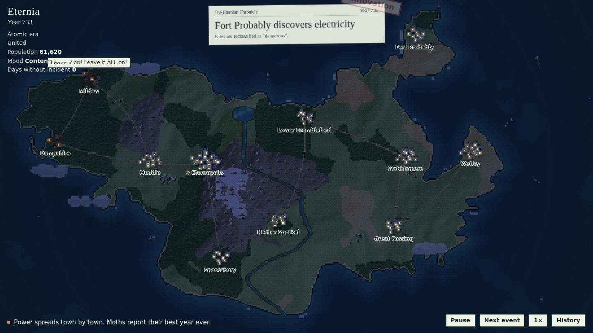

# Eternia

A tiny fictional country, drawn in pixels, where history happens to it. One event at a time, forever.

Eternia splits into East and West over how to pronounce "scone", invents the wheel, discovers electricity, accidentally presses the big red button, goes back to the Stone Age, and starts again. Meanwhile giant pigeons steal towns, a wizard turns one into cheese, and the moose migration stops all traffic.



## Run it

It's a single self-contained page. Build it, then open `index.html` in a browser:

```bash
python build.py          # inlines src/*.js into template.html -> index.html
open index.html          # or just double-click it
```

No dependencies, no bundler. The only network request is for two Google Fonts (Young Serif and Pixelify Sans), with system fallbacks if they don't load.

## Controls

| Key | Action |
| --- | --- |
| Space | Pause / resume |
| N | Skip to the next event |
| C | History (the chronicle) |
| H | Hide the interface |
| `[` `]` | Slower / faster (0.5× to 4×) |
| R | Start a new history |
| F | Fullscreen |
| M | Sound on / off |
| S | Settings |
| D | Debug view (then E cycles the era) |

Click any town to see its population, condition and personal history. The buttons in the corner do the same things, plus sound, settings and sharing.

## Sound, settings and sharing

- **Sound** is synthesised live with the Web Audio API (no audio files): stamps, booms, lightning, splashes, fireworks, a little chatter for every speech bubble, waves and rain, and a slow music box that changes key with the country's mood. Browsers only allow audio after a click, so it starts muted.
- **Settings** are generated from one schema in `src/09b-settings.js` and saved in the browser: volume, music, ambience, speed, the pause between events, town names, ticker, stats, screen shake, bright flashes, an old-TV look, and which kinds of events can happen. You can also type in a seed to replay a particular history.
- **Share** uses the phone's share sheet when there is one, and otherwise copies a link with the current seed.

URL parameters:

- `?seed=123` replays one exact history. The seed is shown in the History panel with a copy-link button.
- `?event=meteor,aliens` forces which events come first. Handy for testing a new event.

## How it works

The architecture borrows ideas (not code) from [Nagomi](https://github.com/msk1039/nagomi), a pixel koi pond:

- **Low-res world, scaled up.** Everything is drawn into a 480×270 canvas and scaled to the screen with nearest-neighbour sampling. Text (labels, speech bubbles, the newspaper) is HTML on top so it stays crisp.
- **Fixed-step simulation.** The world updates at exactly 60 Hz using an accumulator, separate from rendering, so speed-ups and slow machines behave the same.
- **One event at a time.** The Director is a state machine (interlude → announce → play → aftermath) so events can never overlap. Picking uses a shuffle bag with preconditions and story pressure: a split country gets more likely to reunite the longer it stays split, the Great Rebuild gets likelier the more damage there is, and the era-advancing inventions stay available so history keeps moving.
- **A persistent world.** Events read and change shared state (era, split, ruler, flag, country name, capital, craters, renamed towns, statues, the three rabbits that never left), so history piles up. Old scars slowly grass over.
- **A toolkit, so each event is a short script.** Particles, shockwave rings, arcing projectiles, a terrain painter for things that spread (fire, floods, snow, lava, flowers), weather, night lighting, "spine" creatures (trains, serpents, dragons), crowds, pixel sprites, decals, speech bubbles, camera moves and colour grades.

### Files

```
src/01-core.js           constants, seeded RNG, noise, maths, colour helpers
src/02-map.js            generates Eternia once from a fixed seed: coast, river border, biomes, towns, roads
src/03-world.js          persistent world state, eras, towns and how they're drawn
src/04-render.js         water, split-aware terrain, roads, night, colour grades, camera, final blit
src/05-toolkit.js        particles, rings, projectiles, sprites, decals, speech bubbles
src/05b-toolkit2.js      terrain painter (covers), weather, spines, crowds, era waves, paths
src/06-ambient.js        boats, caravans, the leftover rabbits, town smoke
src/07*-events-*.js      the events, grouped by theme
src/08-director.js       the event state machine and picker
src/09-ui.js             HUD, newspaper, ticker, history drawer, town cards, controls
src/10-main.js           boot and the fixed-step loop
template.html            markup and styles
build.py                 bundles everything into index.html
test/                    headless-browser tools used during development
```

### Writing an event

```js
defineEvent({
  id: 'example',
  title: 'Example',
  stamp: 'Weather',                        // the rubber stamp on the newspaper
  weight: (w) => 1,                        // how likely, given the world
  requires: (w) => w.era >= 1,             // can it happen right now?
  duration: 14,                            // seconds of play
  setup(ev) { ev.city = ev.rng.pick(world.cities); },          // choose targets, no visuals
  headline: (ev) => ({ title: `Something happens in ${ev.city.name}`, sub: 'And it is funny.' }),
  focus: (ev) => ({ x: ev.city.x, y: ev.city.y, zoom: 2 }),   // where the camera looks
  update(ev, dt) {                         // animate, keyed on ev.t
    ev.at(0.2, 't0', () => ticker('A ticker line.'));
    ev.at(3, 'b1', () => say(ev.city, 'A speech bubble', {}));
  },
  draw(ev, g, layer, t) {},                // optional custom drawing: 'ground', 'air' or 'sky'
  finish(ev) { ev.delta('mood', +2); },    // final state; must also be safe when skipped early
});
```

## Testing

`test/run.py` drives the page in headless Chromium through Playwright:

```bash
pip install playwright && playwright install chromium
python test/run.py '?seed=5' '[{"eval":"paused=true; eternia.advance(600); world.eventsPlayed"}]'
```

`window.eternia.advance(seconds)` steps the simulation deterministically, which makes long soak tests and precise screenshots easy. See `test/goto.js` for jumping to a moment inside a specific event.

## Status

All 100 planned events are in, across technology and eras, nature and weather, earth and sky, politics, war, creatures, sci-fi, economy, culture, and a few wholesome ones. Sound, settings, sharing and a phone layout are done.

## Contributing

New events, jokes, sounds and fixes are very welcome. [CONTRIBUTING.md](CONTRIBUTING.md) has an event template, a tour of the toolkit and a short checklist. Ideas without code are welcome too: open an issue with the "New event idea" template.

## Deploying

`index.html` is the whole game in one file, so any static host works.

- **GitHub Pages (automatic):** `.github/workflows/pages.yml` builds and deploys on every push to `main`. Turn it on once under Settings, Pages, Source: GitHub Actions. On a free plan, Pages needs the repository to be public.
- **Cloudflare Pages:** build command `python build.py dist/index.html`, output directory `dist`.
- **Anywhere else:** upload `index.html`.

Rebuild with `python build.py` after changing anything in `src/`.

## Credits and license

The architecture was inspired by [Nagomi](https://github.com/msk1039/nagomi) by msk1039. No code was copied: its ideas (a low-res canvas, fixed-step simulation, agent state machines, a settings schema) were reimplemented from scratch.

Eternia is released under the [MIT License](LICENSE).
